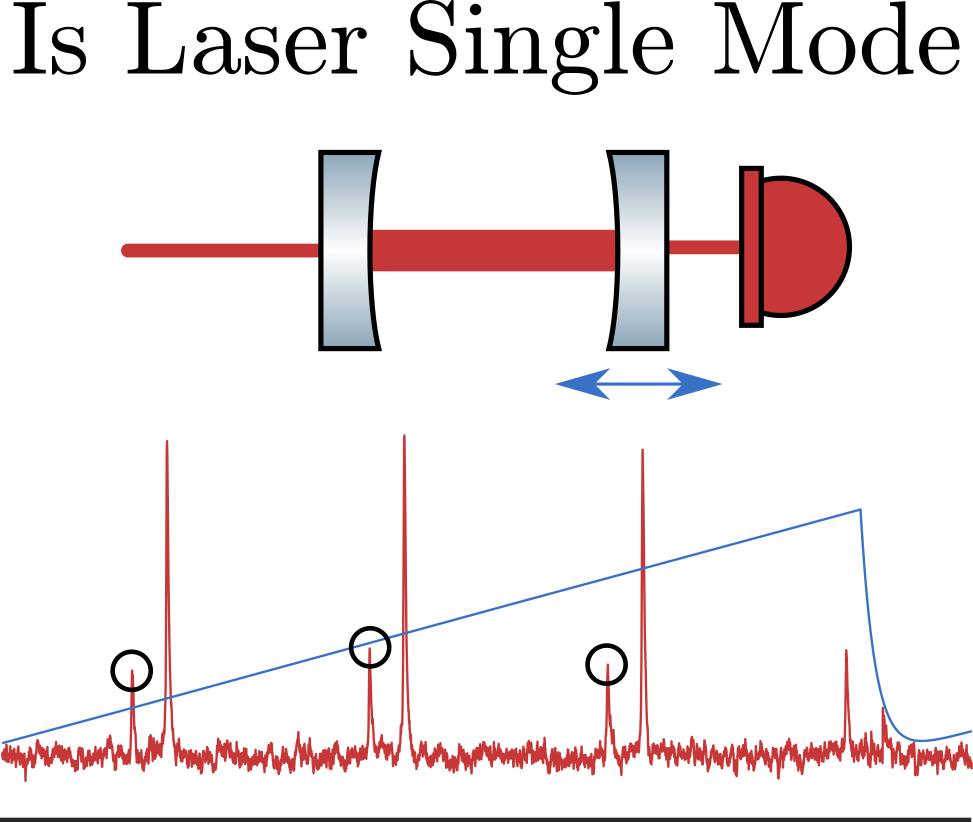

#  
**[Bryce M. Henson](https://github.com/brycehenson)**  
Use a data from a scanning fabry perot interferometer to determine if a laser is single mode.
 
**Status:** This Code is **NOT** ready for use in other projects. Testing is **NOT** implemented or passing.  

a scanning fabry perot interferometer is an optical cavity that changes length via a peizoelectric actuator embeded between the mirrors. As the length changes a laser that is input to the cavity will at times be resonant with a cavity mode and power will pass through it to a photodiode on the other side of the cavity. In this way if you apply a slow ramp to the cavity then you get a series of peaks in the photodiode power at regular intervals. 

A number of types of lasers a suceptable to multi-mode operation where they output power at two or more wavelengths(frequnecies) at the same time. In this case then other peaks are present in the plot of pzt waveform and pd power. The purpose of this code is to process the pzt and photodiode wavefrom in order to determine if the laser is single mode.

## Contributions
- **Chad Greene** [Butterworth Filters](https://au.mathworks.com/matlabcentral/fileexchange/38584-butterworth-filters)
- **Steffen Brueckner**    [crossing](https://au.mathworks.com/matlabcentral/fileexchange/2432-crossing)
- **Alexander Franzen** [optics Component Library](http://www.gwoptics.org/ComponentLibrary/)
